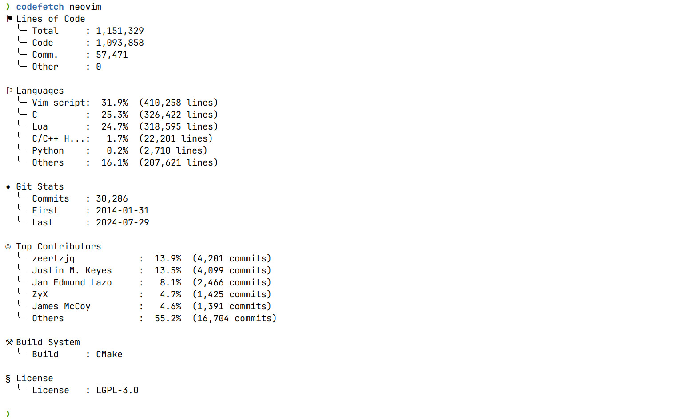

# CodeFetch

A modern, comprehensive code analysis tool for software projects.



## Features
> CodeFetch provides detailed insights into your codebase,offering a complete analysis suite<br> 
> that helps developers understand their projects better through multiple metrics.

- Line counting statistics (code, comments, total)
- Language distribution analysis
- License detection
- Build system identification
- Git repository statistics
  - Commit history
  - Contributor analysis
  - Timeline information
- Multi-threaded file processing
- Beautiful, colorful console output

## Getting Started

### Dependencies
- C++17 or higher
- CMake 3.10+
- libgit2 for Git statistics
- CLI11 for command line parsing

### Build & Install from source
```bash
git clone https://github.com/yourusername/codefetch.git
cd codefetch
mkdir build && cd build
cmake .. && make
# for system-wide installation (may require elevated privileges):
sudo make install
```

## Usage

Basic usage:
```bash
codefetch <directory>    # Analyze directory with all modules
```

Available options:
```bash
-c, --line_counter       Show line counter statistics
-l, --languages          Show language statistics
-g, --git-statistics     Show git statistics information
-m, --metabuild_system   Show metabuild system information
-i, --license            Show license information
-v, --version            Show version information
```


## Contributing
Contributions are welcome! Please feel free to submit a Pull Request.
- Fork the Project
- Create your Feature Branch (`git checkout -b feature/AmazingFeature`)
- Commit your Changes (`git commit -m 'Add some AmazingFeature'`)
- Push to the Branch (`git push origin feature/AmazingFeature`)
- Open a Pull Request

### Adding New Modules
The project is designed to be modular. To add a new analysis module:
1. Create a new class that inherits from `CodeFetchModule`
2. Implement the required virtual functions:
   - `process_file(const fs::path& file_path)`
   - `print_stats() const`
3. Add your module to the main processing loop in `main.cpp`

## License
Distributed under the MIT License. See `LICENSE` file for more information.
